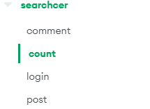

# 즐커뮤니티 개발(오픈소스)

## 프로젝트 명

즐커뮤니티 개발 

## 기획 및 개발

문진혁

## 제작 기간

2022.03.05 ~ 2022.03.07 

## 사용 기술

- **Front-End**: Ejs , Css , Bootstrap
- **Back-End**: Node-Js, Express, MongoDB

## 배포

- **MongoDB 에서 다음처럼 초기 값을 지정**




해당 DB_URL 은 server.js, post.js, board.js, login.js 에 각각 넣어준다. 

- **실행**

```jsx
npm start
```

- **배포 시 프로토 타입 사이트**

[즐 커뮤니티](https://port-0-zzul-community-project-ngsnp25lbs5jgw7.gksl2.cloudtype.app/)

## 프로젝트 기획 배경

 NodeJS와 Express를 배운 후에, 실전에 써보기 위해 커뮤니티 성격의 사이트를 제작

기본적인 CRUD 연습을 해보기 위해 제작

## 추후 예정

- 파일추가 기능
- 댓글의 댓글 기능 구현 —> 게시판-댓글 형식을 이용하여 댓글-대댓글 형식으로 만들면 될 것같음
- 로그인 기능
- 일단 가장 중요한 것은 해당 프로젝트는 REST.API를 전혀 준수하지 않고 제작하여 직접 REST.API에 맞춰서 코드를 변경해보는 연습을 해도 좋을 것같다.
(내가 만들고도 너무 코드가 어지러워서 이걸 응용한 물품관리 프로젝트에서는 싹다 REST.API에 맞춰서 코드를 수정하였다)

## 사용한 프로젝트

[세마고등학교 물품관리 프로젝트 에서 응용](https://github.com/jinhuyk/semasicencedata-portfolio)

## 구현기능 정리
- **DataBase**

    mongoDB를 이용하여 구현하였음.
    Collection을 4개로 구분
    1. comment (댓글 저장 데이터베이스)
    2. count (게시물 및 댓글 번호 저장용)
    3. login (계정 데이터베이스)
    4. post (글 저장 데이터베이스)

    다음처럼 각 데이터베이스 컬렉션에 접근이 가능하다.
    ```javascript
    app.get('/',function(req,res){
    db.collection('post').find().toArray(function(err,rst){
        res.render('main.ejs', {posts : rst })
        })
    })
    ```
    데이터베이스에서 원하는 것을 서버가 가져온 후 이를 편리하게 사용하기 위해 html 대신에 ejs를 이용하였음. 
    ```html
    <span><%= posts[i].date%> | </span>
    ```
    다음처럼 사용 가능


- **6개의 게시판 구현**
    
    
    
    게시판 이동은 다음처럼 구현하였음
    ```javascript
    router.get('/norboard',function(req,res){
        db.collection('post').find({type : "일반"}).toArray(function(err,rst){
            res.render('main.ejs',{posts : rst})
        })
    })
    router.get('/infoboard',function(req,res){
        db.collection('post').find({type : "정보"}).toArray(function(err,rst){

            res.render('main.ejs',{posts : rst})
        })
    })
    router.get('/tmiboard',function(req,res){
        db.collection('post').find({type : "뻘글"}).toArray(function(err,rst){

            res.render('main.ejs',{posts : rst})
        })
    })
    router.get('/funboard',function(req,res){
        db.collection('post').find({type : "웃긴"}).toArray(function(err,rst){
            
            res.render('main.ejs',{posts : rst})
        })
    })
    router.get('/scrtboard',function(req,res){
        db.collection('post').find({type : "비밀"}).toArray(function(err,rst){

            res.render('main.ejs',{posts : rst})
        })
    })
    ```
    post collection에서 type이 해당  게시글인 것들을 추출하여 ejs로 전송


- **기본적인 CRUD 구현**
    
    
    
    (파일선택 기능은 추가 안됨)
    
    

    데이터 입력시 ejs에서 ajax를 이용하여 서버로 데이터 보냄
    ```javascript
    // postAdd.ejs 내 작성 내용 전송
    $.ajax({
                method : 'POST',
                url:'/posting',
                data : 
                {
                    title : title,
                    body : body,
                    type: type,
                    wt : wt,
                    pw : pw,
                    date : date,
                    time : time,
                    scpw : check
                }
        }).done(function(rst){
            redirectList();
        })
    
    ```
    서버에서 데이터베이스에 데이터 저장
    ```javascript
    //post.js 내에서 데이터베이스에 저장 
                    db.collection('post').insertOne(
                    {
                        _id : totalpost+1 , 
                        title : req.body.title , 
                        body : req.body.body , 
                        type : req.body.type,
                        date : req.body.date,
                        time : req.body.time,
                        wt : req.body.wt,
                        pw : rstpw,
                        scpw : req.body.scpw,
                        good:0,
                        wtf : 0,
                        bad : 0,
                        cmt : 0
                    }, function(err,rst){

                    db.collection('count').updateOne({name:'totalP'},{$inc: {totalPost : 1}},function(err,rst){
                        if(err) return console.log(err)
                        res.send('add')
                    })
                })
    ```
    
- **말잇기(댓글) 기능 구현**
    
    
    
    댓글 기능은 거의 글 기능과 비슷하게 프로그래밍을 하였다.(post.js 참고)
    
    해당 글 번호를 댓글 데이터베이스에 넣어 놓고, 그것을 글을 열어볼때 댓글 부분에 글의 번호와 같은 댓글 데이터들을 가져와서 사용한다.

    ```javascript
    db.collection('comment').find({pid : parseInt(req.params.id)}).toArray(function(err,cmt){
                res.render('postDetail.ejs', {data : rst ,cmtdata : cmt})
            })
    ```
    다음처럼 데이터를 가져와서 사용한다. 


- **공감 기능 구현**
    
    
    
    ```javascript
        router.post('/like',function(req,res){
        if(req.body.like == "good"){
            db.collection('post').updateOne({_id : parseInt(req.body.id)},{$inc: {good : 1}},function(err,rst){
                res.send("good") 
            })
            
        }
        if(req.body.like == "wtf"){
            db.collection('post').updateOne({_id : parseInt(req.body.id)},{$inc: {wtf : 1}},function(err,rst){
                res.send("good") 
            })
        }
        if(req.body.like == "bad"){
            db.collection('post').updateOne({_id : parseInt(req.body.id)},{$inc: {bad : 1}},function(err,rst){
                res.send("good") 
            })
        }
    })
    
    ```
    공감 버튼을 누를 경우에 해당 포스트의 공감 관련 카운트를 증가 시킨 후 새로고침
- **비밀게시판 구현**
    
    

    비밀게시판 기능을 구현하기 위해 바로 접속이 아닌 해당 게시물이 비밀게시판인지 일반게시판인지를 구별하는 페이지로 넘어간 후에 올바른 접속을 할 수 있도록 작성
    ```javascript
        router.post('/check',function(req,res){


            db.collection('post').findOne({_id : parseInt(req.body.id)}, function(err,rst){
                if(rst.scpw == req.body.check){
                    db.collection('comment').find({pid : parseInt(req.body.id)}).toArray(function(err,cmt){
                        res.cookie('scrt',req.body.check,{maxAge: 300000 })
                        // 쿠키에 저장하여 300000초 동안은 암호를 입력하지 않고 들어갈 수 있게끔 프로그래밍함.
                        res.render('postDetail.ejs', {data : rst ,cmtdata : cmt})
                    })
                } 
                else {
                    res.redirect('/detail/'+req.body.id)
                }
            })
        })
    ```

- **게시판 암호 등을 암호화**

    계정등을 사용할때 구현해보려고 했으나, 먼저 연습하는 것이 나쁘지 않다고 생각하여 일반 게시물 수정 또는 삭제할 때 사용가능한 비밀번호를 암호화/복호화 하는 코드를 추가하였음.
    
    암호화는 bcrypt.hash()를 이용함.
    ```javascript
    bcrypt.hash(req.body.pw , 10 , function(err,rstpw)
    ```
    다음 암호화를 사용할 경우 다음처럼 데이터베이스에 저장되는 암호가 바뀜
    ```
    "$2a$10$pjhVYxH2mX/CUXzCa.YQJuTJYtHFrHe6nTOreEyS57rexSVnhWVe6"
    ```
    이는 나중에 글 수정 또는 삭제할때 복호화하여 사용
    ```javascript
    bcrypt.compare(req.body.pw, ruser.pw, function(err,rst)
    ```


## 회고
인터넷의 강의와 서적을 통해서 직접 Node.JS와 Express, MongoDB에 대해 배우고 만들어본 사이트였다. 현재 우리나라의 유명 커뮤니티를 한번 따라해보기 위해 제작해보았다. 

지금까지 웹사이트를 만들때는 프론트엔드에만 신경을 썼다. 그래서 처음 벡엔드를 배울때 어떤 식으로 프론트엔드와 주고받아야하는지도 어려웠고, 정확한 기획 없이는 벡엔드는 개발하기 정말 어려운 것이구나를 깨닫게 되었다.

 하지만 글 쓰기/업로드/수정/삭제 에 대한 기능을 완성하니 이번엔 이 글에 대한 댓글 기능을 해보고 싶었고, 이것이 프로그래밍의 재미가 아닐까 싶었다. 이 프로젝트를 이용하여 만든 물품관리 시스템은 조금 더 수정하여 REST.API에 맞추어 만들었다. 이제 다음에 시간이 남는다면 현재 코드 내에 Login 기능이 존재하지만 아직 구현이 되지 않은 상태이다. 이런것들을 하나하나 손보면서 웹 프로그래밍을 공부해보는 것이 재밌을 것 같다. 
